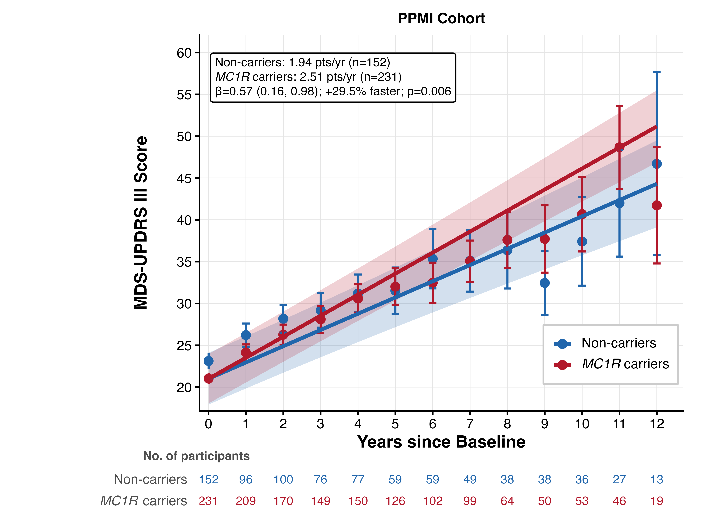
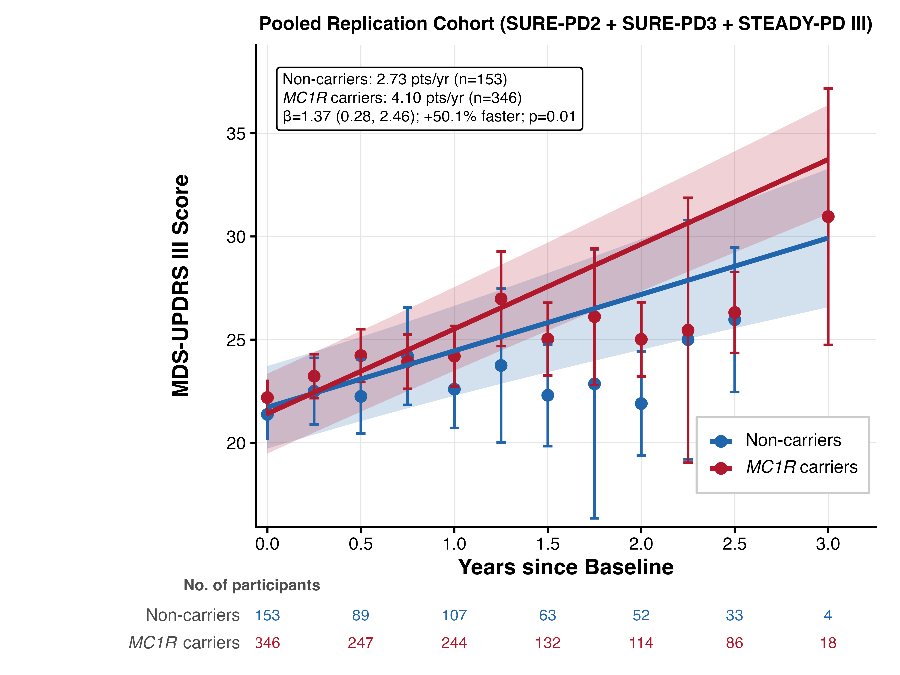
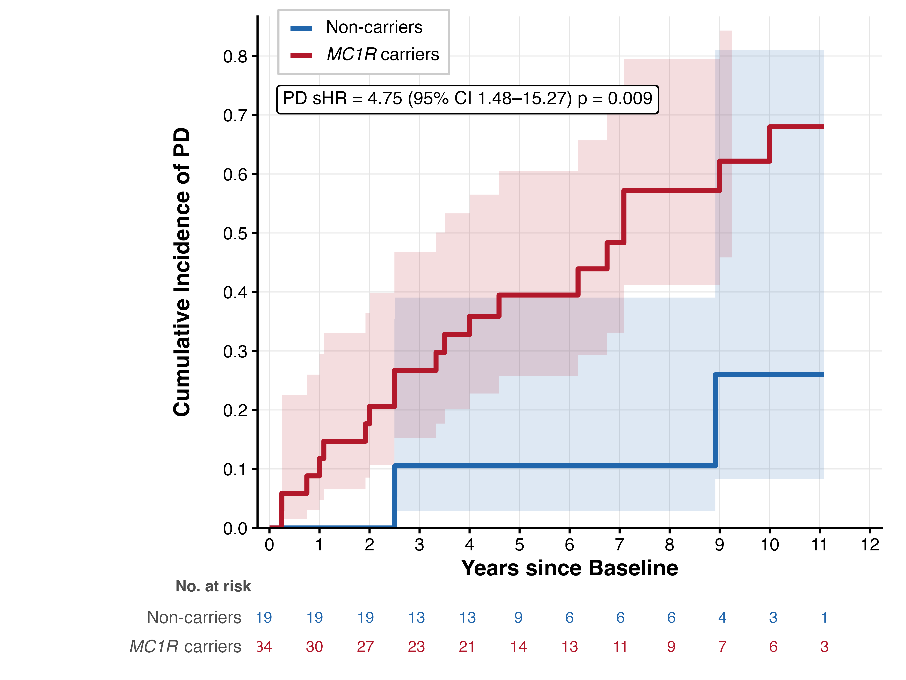

# Common *MC1R* variants and Parkinson disease progression

This repository contains the analysis code, tables, and figures for
Schumacher et al., "Common *MC1R* variants and Parkinson disease
progression."

**Preprint:** [doi:10.64898/2025.12.26.25343003](https://doi.org/10.64898/2025.12.26.25343003)

---

## Overview

Melanocortin 1 receptor (*MC1R*) loss-of-function (LoF) variants impair
eumelanin synthesis and reduce antioxidant capacity. *MC1R* is expressed
in dopaminergic neurons of the substantia nigra, where it may influence
neuronal vulnerability. Phenotypes associated with *MC1R* LoF — lighter
skin, red hair, and melanoma — have each been linked to increased PD
risk, though associations between individual variants and PD risk remain
inconsistent. Approximately 60–70% of individuals of European descent
carry at least one *MC1R* LoF variant.

Using up to 12 years of longitudinal data from the PPMI cohort (383
sporadic PD participants: 231 *MC1R* LoF carriers and 152 non-carriers),
we show that *MC1R* LoF variants are associated with accelerated motor
decline. The finding replicates in a pooled independent cohort of 587
participants from three clinical trials (SURE-PD phase 2, SURE-PD3,
STEADY-PD III). In addition, *MC1R* LoF carriers with prodromal PD show
over fourfold increased risk of phenoconversion to clinically diagnosed
PD.

## Key Findings

- **30% faster motor decline.** *MC1R* LoF carriers (n=231) declined at
  2.51 MDS-UPDRS III points/year versus 1.94 in non-carriers (n=152;
  β=0.57, 95% CI 0.16–0.98, p=0.006).
- **Allele dose-response.** Heterozygotes +27% (p=0.01), homozygotes
  +63% (p=0.03); dose-response p-trend=0.003.
- **Penetrance gradient.** R variants +32% (p=0.01), r variants +27%
  (p=0.04); ordinal trend p=0.01.
- **Variant-specific signals.** R160W +36% (p=0.03) and V92M +33%
  (p=0.04) reached significance. All other variants nominally faster.
- **Bradykinesia and orofacial subscores most affected.** Bradykinesia
  +35.5% (p=0.001), orofacial +25.3% (p=0.03).
- **Independent replication.** In the pooled replication cohort (n=587),
  *MC1R* LoF carriers declined 50% faster (4.10 vs 2.73 pts/yr; β=1.37,
  p=0.01) with visits censored at dopaminergic treatment initiation.
- **Prodromal signal.** *MC1R* LoF carriers (n=34) showed over fourfold
  increased risk of phenoconversion to PD (sHR=4.75, 95% CI 1.48–15.27,
  p=0.009) compared to non-carriers (n=19).



*Figure 1A. Change in MDS-UPDRS III (OFF-state) in the PPMI sporadic
cohort. MC1R LoF carriers (n=231) decline 30% faster than non-carriers
(n=152; β=0.57, p=0.006). Adjusted for age at onset, sex, race, LEDD,
and baseline score.*



*Figure 1B. Pooled replication cohort (SURE-PD phase 2 + SURE-PD3 +
STEADY-PD III). MC1R LoF carriers (n=346) decline 50% faster than
non-carriers (n=153; β=1.37, p=0.01). Visits censored at levodopa or
dopamine agonist initiation.*



*Figure 2. Cumulative incidence of phenoconversion from prodromal to
clinically diagnosed PD. MC1R LoF carriers show over fourfold increased
risk (sHR=4.75, 95% CI 1.48–15.27, p=0.009). Fine-Gray model adjusted
for age and sex, with DLB/MSA phenoconversion as competing event.*

## Data Sources

Source data are not redistributed. All inputs are available to approved
researchers through PPMI and GP2. Full variable descriptions and
download instructions are in [`data/DATA_SOURCES.md`](data/DATA_SOURCES.md).

| Role | Dataset | Access |
|---|---|---|
| Primary analysis | PPMI (PD + Genetic Registry + Prodromal) | [ppmi-info.org](https://www.ppmi-info.org) |
| Replication — SURE-PD3 | Clinical trial, GP2 WGS genotyping | [gp2.org](https://gp2.org) |
| Replication — SURE-PD2 | Clinical trial, GP2 NeuroBooster Array | [gp2.org](https://gp2.org) |
| Replication — STEADY-PD III | Clinical trial, GP2 WGS genotyping | [gp2.org](https://gp2.org) |

## Repository Structure

```
mc1r_progression/
├── README.md                       Project overview and key findings
├── LICENSE                         Apache License 2.0
├── CITATION.cff                    Machine-readable citation metadata
├── .gitignore
│
├── analysis/
│   ├── mc1r_progression_analysis.Rmd   PPMI cohort (primary + all secondary analyses)
│   └── mc1r_progression_validation.Rmd Pooled replication cohort (SURE-PD2/3, STEADY-PD III)
│
├── figures/
│   ├── fig1_ppmi_motor_decline.png          PPMI motor trajectories (Figure 1A)
│   ├── fig2_replication_motor_decline.png   Replication motor trajectories (Figure 1B)
│   ├── fig3_phenoconversion.png             Phenoconversion (Figure 2)
│   ├── efig1_pca_ancestry.png               PPMI PCA (eFigure 1)
│   ├── efig2a_slope_density_ppmi.png        Slope distributions, PPMI (eFigure 2A)
│   ├── efig2b_slope_vs_treatment_ppmi.png   Slope vs treatment, PPMI (eFigure 2B)
│   ├── efig3a_slope_density_replication.png Slope distributions, replication (eFigure 3A)
│   └── efig3b_slope_vs_treatment_replication.png  Slope vs treatment, replication (eFigure 3B)
│
├── tables/
│   ├── table1_demographics.csv                    Demographics (sporadic cohort)
│   ├── table2_motor_decline_subscores.csv         Motor decline with OFF/ON subscores
│   ├── table3_motor_decline_stratified.csv        Motor decline by zygosity, penetrance, variant
│   ├── etable1_monogenic_demographics.csv         Monogenic cohort demographics
│   ├── etable2_carrier_frequency.csv              Carrier frequency across cohorts
│   ├── etable3_maf_gnomad.csv                     MAF in other PD cohorts and gnomAD
│   ├── etable4_fast_progressor_enrichment.csv     Fast-progressor enrichment
│   ├── etable5_motor_subtype.csv                  TD/PIGD motor subtype stratification
│   ├── etable6_combined_cohort_motor_decline.csv  Combined sporadic + monogenic motor decline
│   ├── etable7_cocarrier_motor_decline.csv        LRRK2+MC1R and GBA+MC1R subscore analysis
│   ├── etable8_nonmotor_outcomes.csv              Non-motor and functional outcomes
│   ├── etable9_csf_biomarkers.csv                 CSF biomarkers and SAA kinetics
│   ├── etable10_replication_demographics.csv      Replication cohort demographics
│   └── etable11_prodromal_demographics.csv        Prodromal cohort demographics
│
└── data/
    └── DATA_SOURCES.md             Required variables, accessions, download instructions
```

## Analysis Overview

**mc1r_progression_analysis.Rmd** (PPMI cohort):

Linear mixed-effects models for OFF-state MDS-UPDRS III (primary
outcome) with participant-level random intercepts and slopes,
group-specific residual variance, adjusted for age at onset, sex, race,
baseline score, and LEDD. Analyses include: zygosity, penetrance, and
variant-specific stratifications; allele dose-response trends; bivariate
OFF/ON models for medication attenuation; genetic independence models
(*MC1R* adjusted for *LRRK2*/*GBA*); three-way interaction tests (age,
sex, disease duration); population-stratification sensitivity analyses
(European-restricted, PC1–10 adjusted); secondary outcomes (MDS-UPDRS
I/II/IV, MoCA, DAT-SPECT, SCOPA-AUT, GDS, ESS); baseline CSF biomarker
comparisons; Fine-Gray subdistribution hazards model for prodromal
phenoconversion; fast-progressor enrichment; and TD/PIGD motor subtype
stratification.

**mc1r_progression_validation.Rmd** (replication cohort):

Pooled analysis across three null clinical trials with visits censored
at initiation of levodopa or dopamine agonist therapy. Models adjusted
for age at onset, sex, race, baseline score, MAO-B inhibitor use, source
cohort, and treatment arm. Includes Goetz-calibrated UPDRS-to-MDS-UPDRS
conversion for SURE-PD phase 2 and STEADY-PD III, co-carrier adjusted
models (*LRRK2*/*GBA*), and subscore analyses.

## Requirements

R ≥ 4.4 with:

- nlme ≥ 3.1-164
- survival ≥ 3.6-4
- dplyr, tidyr, readr, readxl
- ggplot2, ggtext, pammtools
- openxlsx
- patchwork

## Reproducing

Place PPMI and GP2 inputs under `Data/` at the repository root following
the layout described in each RMD's config block and in
[`data/DATA_SOURCES.md`](data/DATA_SOURCES.md), then render from the
repository root:

```r
rmarkdown::render("analysis/mc1r_progression_analysis.Rmd")
rmarkdown::render("analysis/mc1r_progression_validation.Rmd")
```

Both RMDs set `knitr::opts_knit$set(root.dir = normalizePath(".."))` so
all paths resolve relative to the repo root regardless of working
directory. Outputs are written to `Output/`.

## Citation

Publication pending. A preprint is available at
[doi:10.64898/2025.12.26.25343003](https://doi.org/10.64898/2025.12.26.25343003).
Please cite this repository and the preprint until the peer-reviewed
article is published:

```bibtex
@article{schumacher2025mc1r,
  title   = {Common {MC1R} variants and {Parkinson} disease progression},
  author  = {Schumacher, Jackson G. and Zhang, Xinyuan and Wang, Jian
             and Dijkstra, Johannes M. and Watanabe, Hirohisa
             and Gao, Xiang and Cortese, Marianna and Macklin, Eric A.
             and Schwarzschild, Michael A. and Chen, Xiqun},
  year    = {2025},
  doi     = {10.64898/2025.12.26.25343003},
  note    = {Preprint; peer-reviewed publication pending}
}
```

## Acknowledgements

This research was funded in part by Aligning Science Across Parkinson's
grants ASAP-000312 and MJFF-028544 through the Michael J. Fox Foundation
for Parkinson's Research (MJFF) and by the National Institutes of Health
through the National Institute of Neurological Disorders and Stroke
grant R01NS102735. For the purpose of open access, the author has
applied a CC BY public copyright license to all Author Accepted
Manuscripts arising from this submission.

Data used in the preparation of this article were obtained from the
Parkinson's Progression Markers Initiative (PPMI) database
([ppmi-info.org/data](https://www.ppmi-info.org/data)). For up-to-date
information on the study, visit
[ppmi-info.org](https://www.ppmi-info.org). PPMI is a public–private
partnership funded by the Michael J. Fox Foundation for Parkinson's
Research and funding partners, including 4D Pharma, Abbvie, AcureX,
Allergan, Amathus Therapeutics, Aligning Science Across Parkinson's,
AskBio, Avid Radiopharmaceuticals, BIAL, BioArctic, Biogen, Biohaven,
BioLegend, BlueRock Therapeutics, Bristol-Myers Squibb, Calico Labs,
Capsida Biotherapeutics, Celgene, Cerevel Therapeutics, Coave
Therapeutics, DaCapo Brainscience, Denali, Edmond J. Safra Foundation,
Eli Lilly, Gain Therapeutics, GE HealthCare, Genentech, GSK, Golub
Capital, Handl Therapeutics, Insitro, Jazz Pharmaceuticals, Johnson &
Johnson Innovative Medicine, Lundbeck, Merck, Meso Scale Discovery,
Mission Therapeutics, Neurocrine Biosciences, Neuron23, Neuropore,
Pfizer, Piramal, Prevail Therapeutics, Roche, Sanofi, Servier, Sun
Pharma Advanced Research Company, Takeda, Teva, UCB, Vanqua Bio, Verily,
Voyager Therapeutics, the Weston Family Foundation and Yumanity
Therapeutics. Data used in the preparation of this article were obtained
from Global Parkinson's Genetics Program (GP2). GP2 is funded by the
Aligning Science Across Parkinson's (ASAP) initiative and implemented by
The Michael J. Fox Foundation for Parkinson's Research. For a complete
list of GP2 members see [gp2.org](https://gp2.org).

## License

Apache License 2.0 — see [`LICENSE`](LICENSE).

## Contact

Jackson G. Schumacher — [jgschumacher@mgh.harvard.edu](mailto:jgschumacher@mgh.harvard.edu)
